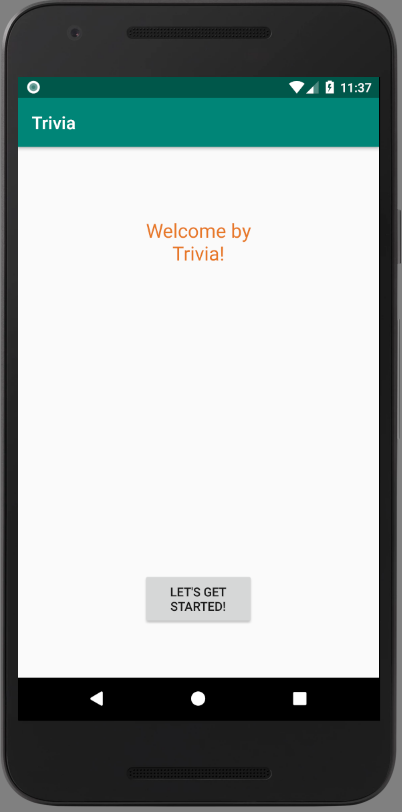
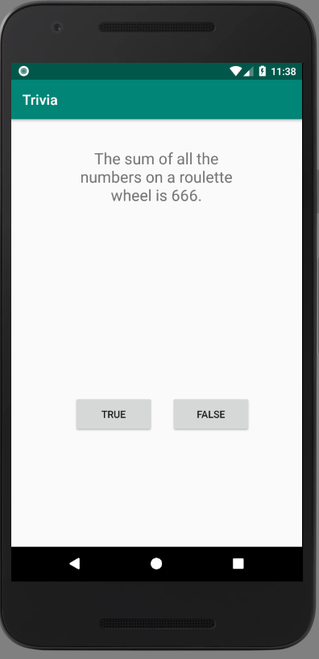

# Trivia

Sjoerd Terpstra, 11251980
Minor programmeren, App Studio
12-12-2018

This app implements a trivia game. A user has to answer ten questions. Afterwards points are awarded and the player can sent his highscores.
After sending a user's highscores, the highscores are retrieved from a server to present them to the user

## Screenshots

